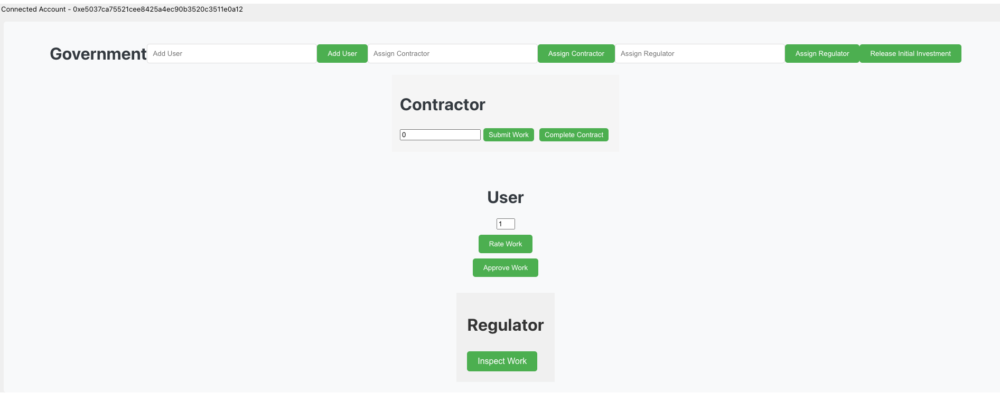

# PPPContract
PPP contract on blockchain

Work Flow of the smart contract

1. The contract is initialized with the government as the contract deployer, and the contract funds are set to 45 lakhs Indian rupees.
2. The government assigns a contractor, regulator, and users to the contract.
3. Users are added by the government to the contract.
4. The government releases an initial investment of 15 lakhs Indian rupees.
5. The contractor submits the work completed for the current month, limited to a maximum of 25% of the total work.
6. Users review and approve the submitted work.
7. Users rate the quality of the work on a scale of 1 to 5.
8. The regulator inspects the work and calculates the average rating based on the users' ratings.
9. If the average rating is above 75%, the regulator approves the work.
10. The contractor completes the contract by ensuring that the completion period has elapsed and the total work completed is at least 100%.
11. Once the contract is completed and approved by the regulator, the funds are released.
12. The final project is rated by the customer

## Solidity Code for the contract ##

##### UI Pages ##
Very basic pages for the stahe holders

##Need deploy the contract and integrate the UI using Hardhat

Index(Landing) Page
